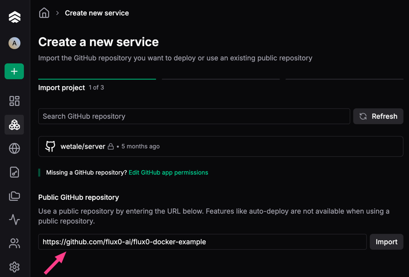

# 🚀 Deploying flux0 to Koyeb

Koyeb is a great platform for hosting [Flux0](https://github.com/flux0-ai/flux0) in the cloud with minimal setup.
it is a great choice for hosting production-ready `flux0` agents with zero infrastructure overhead.
This guide walks you through deploying Flux0 via GitHub as a Koyeb service.


## 🌟 Why Koyeb?

Koyeb is a great match for `flux0` agents. Here's why:

- **Git-powered deploys**
  Push your agents to GitHub and Koyeb deploys it automatically — no CI/CD needed.

- **Built-in secret management**
  Store API keys like `OPENAI_API_KEY` securely as environment variables.

- **Zero infrastructure**
  No servers, no containers — just your agents code running in the cloud.

- **Global performance**
  Agents run behind a CDN and auto-scale with traffic, out of the box.

- **HTTPS & custom domains**
  Every agent is live on HTTPS by default, with custom domain support.

Koyeb handles the deploys, flux0 handles the rest — from multi-agent logic to session state and LLM calls. You focus on agent behavior, hit git push, and it’s live.

## 🧾 What You’ll Need

- A GitHub repository with your `flux0` app
- A [Koyeb account](https://app.koyeb.com)
- Python 3.13+ compatibility
- LLM (e.g, OpenAI) API key

## 🚀 Deployment Steps

### 🔐 Step1: Create a Secret

To securely store sensitive values as the API key:

1. Go to your [Koyeb Dashboard](https://app.koyeb.com/).
2. Navigate to **Secrets** in the sidebar.
3. Click **"Create Secret"**.
4. Name your secret (e.g., `openai-api-key`) and paste the value.
5. Save it.


### 🧠 Step2: Agent Logic

Your agent logic should live inside a folder under `modules`, for example [modules/my_agent](https://github.com/flux0-ai/flux0-docker-example/tree/main/modules/my_agent).

### Step 3: Push to GitHub

Make sure your `flux0` app is in a public or private GitHub repository.

:::tip
You can fork https://github.com/flux0-ai/flux0-docker-example with your agent code or use this repo directly in Koyeb for demonstration.
:::

### Step4: Create a Koyeb App (Service)

1. Go to [app.koyeb.com](https://app.koyeb.com)
2. Click **Create Service**
3. Choose:
   - **GitHub** as your source
   - The correct repository and branch (e.g., https://github.com/flux0-ai/flux0-docker-example)


#### Choose a repo

Connect your private repo or choose a public one and click _import_.



#### Configure service

Select a CPU of your choice and click _Next_ (_CPU Eco_ should be sufficient for demonstration purposes)

##### Builder

Define **Builder** to Dockerfile and leave all settings as default.

##### Environment variables

| Key              | Example Value                       |
| ---------------- | ----------------------------------- |
| `OPENAI_API_KEY` | `{{ secret.openai-api-key }}`       |
| `FLUX0_MODULES`  | `my_agent`                          |

##### Exposed Ports

Change port to `8080`

### ✅ Step5: Verify Your Deployment

- Click **Deploy**
- Wait for the service to be deployed.
- Click the _Public URL_, you should see the chat interaface.

## 🧾 Step 6: Register the Agent

Once your runner is defined and your module is registered, you can create the agent entry in the database:

1. Cick _manage your service_.
2. Click _Console_ and press Enter
3.

```bash
flux0 agents create --name "Translation Agent" --type langchain_simple
```

## 💬 Step 7: Talk to Your Agent

Start chatting with your agent at the service URL.

## 📚 Related

- [Koyeb Docs](https://www.koyeb.com/docs)
- [flux0 GitHub](https://github.com/your-org/flux0)
